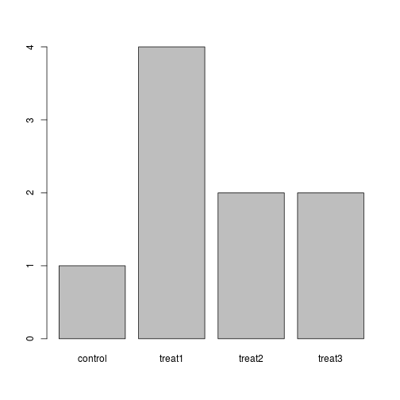
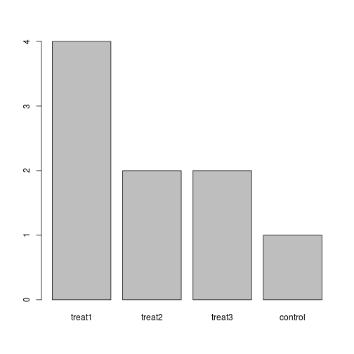

------------

> ## Learning Objectives
>
> * Describe what a data.frame is.
> * Summarize the contents of a dataframe in R.
> * Load external data from a .csv file into R.
> * Manipulate categorical data in R.

------------

## Presentation of the Survey Data


We are studying the species and weight of animals caught in plots in our study
area. The dataset is stored as a comma separated value (CSV) file.
Each row holds information for a single animal, and the columns represent:

| Column           | Description                        |
|------------------|------------------------------------|
| record\_id       | Unique id for the observation      |
| month            | month of observation               |
| day              | day of observation                 |
| year             | year of observation                |
| plot\_id         | ID of a particular plot            |
| species\_id      | 2-letter code                      |
| sex              | sex of animal ("M", "F")           |
| hindfoot\_length | length of the hindfoot in mm       |
| weight           | weight of the animal in grams      |
| genus            | genus of animal                    |
| species          | species of animal                  |
| taxa             | e.g. Rodent, Reptile, Bird, Rabbit |
| plot\_type       | type of plot                       |

We are going to use the R function `download.file()` to download the CSV file
that contains the survey data from figshare, and we will use `read.csv()` to
load into memory the content of the CSV file as a `data.frame`.

To download the data into the `data/` subdirectory, do:


```r
download.file("https://ndownloader.figshare.com/files/2292169",
              "data/portal_data_joined.csv")
```

You are now ready to load the data:


```r
surveys <- read.csv('data/portal_data_joined.csv')
```

This statement doesn't produce any output because, as you might recall,
assignment doesn't display anything. If we want to check that our data has been
loaded, we can print the variable's value: `surveys`.

Wow... that was a lot of output. At least it means the data loaded
properly. Let's check the top (the first 6 lines) of this `data.frame` using the
function `head()`:


```r
head(surveys)
```

```
##   record_id month day year plot_id species_id sex hindfoot_length weight
## 1         1     7  16 1977       2         NL   M              32     NA
## 2        72     8  19 1977       2         NL   M              31     NA
## 3       224     9  13 1977       2         NL                  NA     NA
## 4       266    10  16 1977       2         NL                  NA     NA
## 5       349    11  12 1977       2         NL                  NA     NA
## 6       363    11  12 1977       2         NL                  NA     NA
##     genus  species   taxa plot_type
## 1 Neotoma albigula Rodent   Control
## 2 Neotoma albigula Rodent   Control
## 3 Neotoma albigula Rodent   Control
## 4 Neotoma albigula Rodent   Control
## 5 Neotoma albigula Rodent   Control
## 6 Neotoma albigula Rodent   Control
```

A `data.frame` is the representation of data in the format of a table where the
columns are vectors that all have the same length. Because the column are
vectors, they all contain the same type of data. We can see this when inspecting
the __str__ucture of a `data.frame` with the function `str()`:


```r
str(surveys)
```

```
## 'data.frame':	34786 obs. of  13 variables:
##  $ record_id      : int  1 72 224 266 349 363 435 506 588 661 ...
##  $ month          : int  7 8 9 10 11 11 12 1 2 3 ...
##  $ day            : int  16 19 13 16 12 12 10 8 18 11 ...
##  $ year           : int  1977 1977 1977 1977 1977 1977 1977 1978 1978 1978 ...
##  $ plot_id        : int  2 2 2 2 2 2 2 2 2 2 ...
##  $ species_id     : Factor w/ 48 levels "AB","AH","AS",..: 16 16 16 16 16 16 16 16 16 16 ...
##  $ sex            : Factor w/ 3 levels "","F","M": 3 3 1 1 1 1 1 1 3 1 ...
##  $ hindfoot_length: int  32 31 NA NA NA NA NA NA NA NA ...
##  $ weight         : int  NA NA NA NA NA NA NA NA 218 NA ...
##  $ genus          : Factor w/ 26 levels "Ammodramus","Ammospermophilus",..: 13 13 13 13 13 13 13 13 13 13 ...
##  $ species        : Factor w/ 40 levels "albigula","audubonii",..: 1 1 1 1 1 1 1 1 1 1 ...
##  $ taxa           : Factor w/ 4 levels "Bird","Rabbit",..: 4 4 4 4 4 4 4 4 4 4 ...
##  $ plot_type      : Factor w/ 5 levels "Control","Long-term Krat Exclosure",..: 1 1 1 1 1 1 1 1 1 1 ...
```

### Challenge

Based on the output of `str(surveys)`, can you answer the following questions?

* What is the class of the object `surveys`?
* How many rows and how many columns are in this object?
* How many species have been recorded during these surveys?


<details>

```r
class(surveys)
```

```
## [1] "data.frame"
```

```r
dim(surveys)
```

```
## [1] 34786    13
```

```r
str(surveys$species_id)
```

```
##  Factor w/ 48 levels "AB","AH","AS",..: 16 16 16 16 16 16 16 16 16 16 ...
```
</details>

As you can see, many of the columns consist of integers, however, the columns
`species` and `sex` are of a special class called a `factor`. Before we learn
more about the `data.frame` class, let's talk about factors. They are very
useful but not necessarily intuitive, and therefore require some attention.


## Factors


Factors are used to represent categorical data. Factors can be ordered or
unordered, and understanding them is necessary for statistical analysis and for
plotting.

Factors are stored as integers, and have labels associated with these unique
integers. While factors look (and often behave) like character vectors, they are
actually integers under the hood, and you need to be careful when treating them
like strings.

Once created, factors can only contain a pre-defined set of values, known as
*levels*. By default, R always sorts *levels* in alphabetical order. For
instance, if you have a factor with 2 levels:


```r
sex <- factor(c("male", "female", "female", "male"))
```

R will assign `1` to the level `"female"` and `2` to the level `"male"` (because
`f` comes before `m`, even though the first element in this vector is
`"male"`). You can check this by using the function `levels()`, and check the
number of levels using `nlevels()`:


```r
levels(sex)
```

```
## [1] "female" "male"
```

```r
nlevels(sex)
```

```
## [1] 2
```

Sometimes, the order of the factors does not matter, other times you might want
to specify the order because it is meaningful (e.g., "low", "medium", "high") or
it is required by a particular type of analysis. Additionally, specifying the
order of the levels allows for level comparison:


```r
food <- factor(c("low", "high", "medium", "high", "low", "medium", "high"))
levels(food)
```

```
## [1] "high"   "low"    "medium"
```

```r
food <- factor(food, levels=c("low", "medium", "high"))
levels(food)
```

```
## [1] "low"    "medium" "high"
```

```r
min(food) ## doesn't work
```

```
## Error in Summary.factor(structure(c(1L, 3L, 2L, 3L, 1L, 2L, 3L), .Label = c("low", : 'min' not meaningful for factors
```

```r
food <- factor(food, levels=c("low", "medium", "high"), ordered=TRUE)
levels(food)
```

```
## [1] "low"    "medium" "high"
```

```r
min(food) ## works!
```

```
## [1] low
## Levels: low < medium < high
```

In R's memory, these factors are represented by integers (1, 2, 3), but are more
informative than integers because factors are self describing: `"low"`,
`"medium"`, `"high"`" is more descriptive than `1`, `2`, `3`. Which is low?  You
wouldn't be able to tell just from the integer data. Factors, on the other hand,
have this information built in. It is particularly helpful when there are many
levels (like the species in our example data set).

### Converting factors

If you need to convert a factor to a character vector, you use
`as.character(x)`.

Converting factors where the levels appear as numbers (such as concentration
levels) to a numeric vector is a little trickier.  One method is to convert
factors to characters and then numbers.  Another method is to use the `levels()`
function. Compare:


```r
f <- factor(c(1, 5, 10, 2))
as.numeric(f)               ## wrong! and there is no warning...
```

```
## [1] 1 3 4 2
```

```r
as.numeric(as.character(f)) ## works...
```

```
## [1]  1  5 10  2
```

```r
as.numeric(levels(f))[f]    ## The recommended way.
```

```
## [1]  1  5 10  2
```

Notice that in the `levels()` approach, three important steps occur:

* We obtain all the factor levels using `levels(f)`
* We convert these levels to numeric values using `as.numeric(levels(f))`
* We then access these numeric values using the underlying integers of the
  vector `f` inside the square brackets

### Challenge

The function `plot()` can be used to quickly create a bar plot of a factor. For instance, for the factor
`exprmt <- factor(c("treat1", "treat2", "treat1", "treat3", "treat1", "control", "treat1", "treat2", "treat3"))`, the code `plot(exprmt)`
gives you a barplot of the number of observations at each level, as shown
below.

* What determines the order in which the treatments are listed in the plot? (Hint: use `str` to inspect the factor.)
* How can you recreate this plot with "control" listed last instead
of first?





<details>

```r
## Answers
##
## * The treatments are listed in alphabetical order because they are factors.
## * By redefining the order of the levels
exprmt <- factor(exprmt, levels=c("treat1", "treat2", "treat3", "control"))
plot(exprmt)
```


</details>
