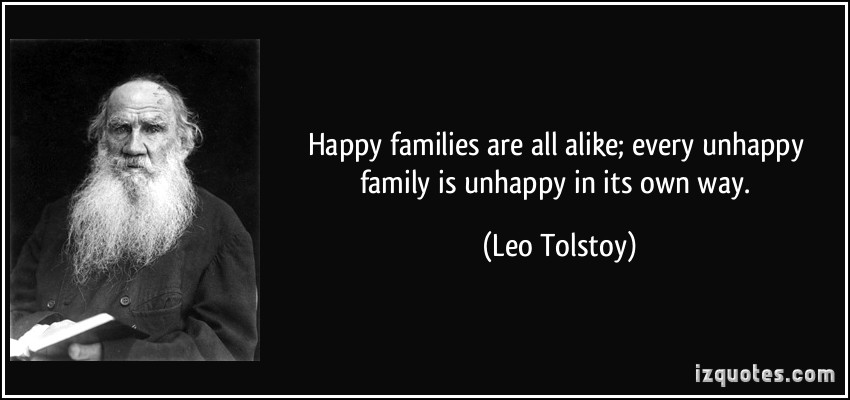
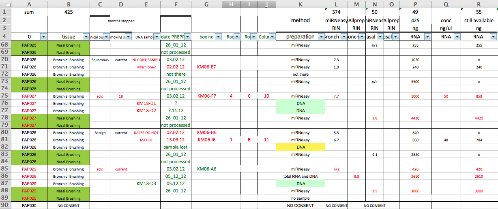
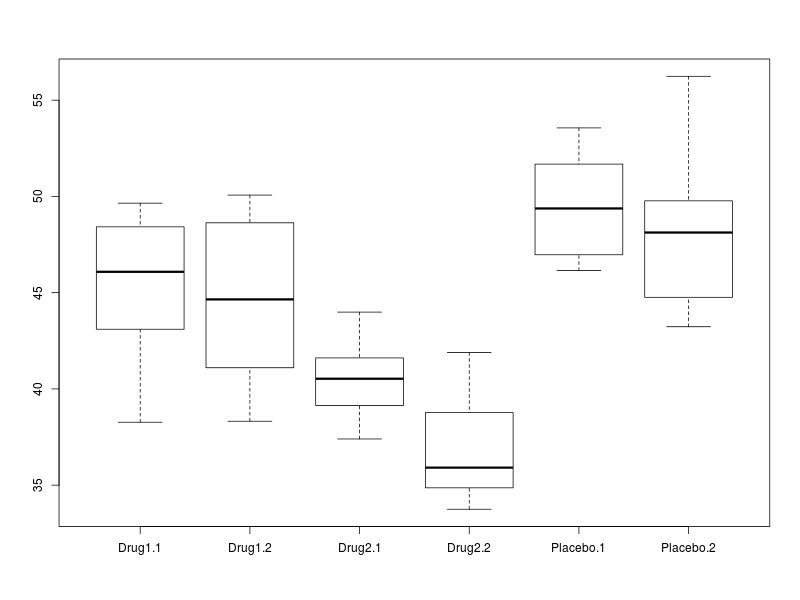

# Overview of this section

- tidy data
    + what it means
    + how to create it
- **`select`** and **`mutate`** verbs in dplyr
- advice for cleaning strings and dates




> Like families, tidy datasets are all alike but every messy dataset is messy in its own way - (Hadley Wickham)

http://vimeo.com/33727555

http://vita.had.co.nz/papers/tidy-data.pdf

# Tidy Data

Tidy data are important because they are an entry point for the *analysis cycle* we will describe during the course.


As we saw, our data, and especially data we might find out "in the wild", may need "cleaning"" before we can use it. We will discuss how to clean our data for analysis. However, there are steps you can take to make sure your data are tidy and organised before importing into R.

- [Karl Broman's tutorial on Data Organisation](http://kbroman.org/dataorg/)
- ["Data Carpentry" workshop](http://lgatto.github.io/2016-05-16-CAM/)




## The data frame

The data frame object in R allows us to work with "tabular" data, like we might be used to dealing with in Excel, where our data can be thought of having rows and columns. The values in each column have to all be of the same type (i.e. all numbers or all text).


The `iris` data frame is a [classic dataset](https://en.wikipedia.org/wiki/Iris_flower_data_set) that is built into R. To load these data, we tidy the variable name `iris` (notice no quotation marks) in brackets. This dataset is also a good example of data in the tidy form.

N.B. As we will see later, we tend to read datasets into R using `read.csv`, `read.delim` or similar functions.

```{r}
iris
```

The `View` function will create a tab in RStudio that we can use to browse the data.

```{r eval=FALSE}
View(iris)
```

The following will create a boxplot of the values in `Sepal.Length` column categorised into the different values of `Species`. Such a plot allows us to look for differences in mean between different groups, and also assess the variability of the data.

```{r}
boxplot(iris$Sepal.Length~iris$Species)
```


An *analysis of variance* (ANOVA) analysis can also tell us if the differences between the groups are statistically significant

```{r}
mod <- aov(iris$Petal.Length~iris$Species)
anova(mod)
```

## Example (from tidyr paper)

Consider the following....

Name          | treatmenta | treatmentb
------------- | -----------|-----------
John Smith    |    -       |    2
Jane Doe      |    16      |    11 
Mary Johnson  |    3       |    1


Data in this format are quite familiar to us, but not easily-interpret able by the computer. We need to think of the dataset in terms of *variables* and *values*. In this example dataset we have *18* values and *3* variables

1. Person (John, Jane or Mary)
2. Treatment (A or B)
3. "Result"

The guiding principles:

- Each column is a variable
- Each row is an observation
- Each type of observational unit forms a table

The tidy form of this data thus becomes;

Name          | Treatment  | Result
------------- | -----------|-----------
John Smith    |    a       |    -
Jane Doe      |    a       |    16 
Mary Johnson  |    a       |    3
John Smith    |    b       |    2
Jane Doe      |    b       |    11
Mary Johnson  |    b       |    1

We can read these data from the file `tidyr-example.txt`

```{r}
untidy <- read.delim("./data/tidyr-example.txt")
untidy
```


## Using tidyr to tidy a dataset

`gather` is a function in the `tidyr` package that can collapse multiple columns into key-value pairs. 

- similar to `stack` in base R
- or `melt` in the `reshape` / `reshape2` packages

The arguments to `gather` are;

- the data frame you want to manipulate
- the name of the *key* column you want to create
- the name of the *value* column you want to create
- the *names* of the columns in the data frame that are to be collapsed
    + note you don't need "" to define the column names
        

```{r warning=FALSE}
library(tidyr)
gather(untidy, Treatment, Result, c(treatmenta,treatmentb))
```

(*Ideally, the `Treatment` column should just be `a` or `b`, but we'll see how to change this later-on*)

When specifying columns, an alternative is to ignore some column names

```{r warning=FALSE}
gather(untidy, Treatment, Result, -Name)
```

Can also specify column index

```{r warning=FALSE}
gather(untidy, Treatment, Result, 2:3)
```

Note that after all these operations, the original data frame (`untidy`) is unaltered

  - we need to create a new variable to save the result
  - you should never work directly on the raw data

```{r warning=FALSE}
untidy
tidy <- gather(untidy, Treatment, Result, c(treatmenta,treatmentb))
```

******

## Exercise: Simulated clinical data

Lets read some typical data from a clinical trial.

- Each patient was given a number of different treatments; Placebo, and two different drugs
    + Two replicates of each
- Some kind of measurement was performed to assess the effect of the drug
- Overall question is the effect of the treatment 

```{r,warning=FALSE}
messyData <- read.delim("./data/clinicalData.txt")
messyData
```

- What variables and observations do we have?
- What might a 'tidy' version of the dataset look like?
- Can you make the following boxplot to visualise the effect of the different treatments?



<details>

```{r, eval=FALSE}
tidyData <- gather(messyData, key = Treatment, value = Value,-Subject)
boxplot(tidyData$Value~tidyData$Treatment)
```
</details>

******

## Other useful functions in 'tidyr'

`tidyr` has a few more useful functions that we can demonstrate on the `tidyData` object you should have just created

- `spread` has the opposite effect to `gather` and will translate tidy data back into human-readable form
    + arguments are the *Key* and *Value* columns in the tidy data frame

```{r}
spread(tidyData, key = Treatment,value=Value)
```

- `separate` can be used to split column names that are comprised by two different parts with a common separating character. e.g. `Drug1.1`, `Drug1.2` etc.
    + it should be able to guess that a `.` character is being used to join the two different parts of the name together
    + we can explicitly say the separator being used. Apart from the `.` in our example other common values are `-`, `_`, `:`.

```{r}
separate(tidyData, "Treatment",into=c("Treatment","Replicate"))
```
