#### Disclaimer

We will be using the functions in the ggplot2 package. R has powerful built-in
plotting capabilities, but for this exercise, we will be using the ggplot2
package, which facilitates the creation of highly-informative plots of
structured data.

> ### Learning Objectives
>
> By the end of this lesson the learner will:
>
> * Produce scatter plots, bloxplots, and time series plots using ggplot.
> * Set universal plot settings.
> * Modify the aesthetics of an existing ggplot plot (including axis labels and color).
> * Build complex and customized plots from data in a dataframe.


We start by loading the required packages.


```r
library(ggplot2)
library(dplyr)
```

## Plotting with ggplot2

`ggplot2` is a plotting package that makes it simple to create complex plots
from data in a dataframe. It uses default settings, which help creating
publication quality plots with a minimal amount of settings and tweaking.

ggplot graphics are built step by step by adding new elements.

To build a ggplot we need to:

- bind the plot to a specific data frame using the `data` argument


```r
ggplot(data = surveys_complete)
```

- define aesthetics (`aes`), by selecting the variables to be plotted and the variables to define the presentation
     such as plotting size, shape color, etc.,


```r
ggplot(data = surveys_complete, aes(x = weight, y = hindfoot_length))
```

- add `geoms` -- graphical representation of the data in the plot (points,
     lines, bars). To add a geom to the plot use `+` operator:


```r
ggplot(data = surveys_complete, aes(x = weight, y = hindfoot_length)) +
  geom_point()
```


The `+` in the `ggplot2` package is particularly useful because it allows you
to modify existing `ggplot` objects. This means you can easily set up plot
"templates" and conveniently explore different types of plots, so the above
plot can also be generated with code like this:


```r
# Create
surveys_plot <- ggplot(data = surveys_complete, aes(x = weight, y = hindfoot_length))

# Draw the plot
surveys_plot + geom_point()
```


Notes:

- Anything you put in the `ggplot()` function can be seen by any geom layers
  that you add (i.e., these are universal plot settings). This includes the x and
  y axis you set up in `aes()`.
- You can also specify aesthetics for a given geom independently of the
  aesthetics defined globally in the `ggplot()` function.
- The `+` sign used to add layers must be placed at the end of each line containing
a layer; if, instead, the `+` sign is added in the line before the other layer,
`ggplot2` will not add the new layer and will return an error message.


```r
# this is the correct syntax for adding layers
surveys_plot +
  geom_point()

# this will not add the new layer and will return an error message
surveys_plot
  + geom_point()
```

## Building your plots iteratively

Building plots with ggplot is typically an iterative process. We start by
defining the dataset we'll use, lay the axes, and choose a geom.


```r
ggplot(data = surveys_complete, aes(x = weight, y = hindfoot_length)) +
    geom_point()
```


Then, we start modifying this plot to extract more information from it. For
instance, we can add transparency (alpha) to avoid overplotting.


```r
ggplot(data = surveys_complete, aes(x = weight, y = hindfoot_length)) +
    geom_point(alpha = 0.1)
```


We can also add colors for all the points


```r
ggplot(data = surveys_complete, aes(x = weight, y = hindfoot_length)) +
    geom_point(alpha = 0.1, color = "blue")
```

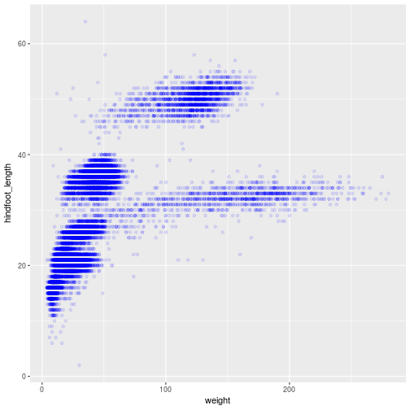

Or to color each species in the plot differently:


```r
ggplot(data = surveys_complete, aes(x = weight, y = hindfoot_length)) +
    geom_point(alpha = 0.1, aes(color=species_id))
```


## Boxplot

Visualising the distribution of weight within each species.


```r
ggplot(data = surveys_complete, aes(x = species_id, y = hindfoot_length)) +
    geom_boxplot()
```

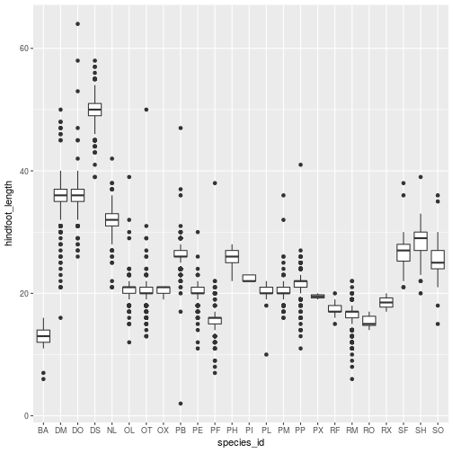

By adding points to boxplot, we can have a better idea of the number of
measurements and of their distribution:


```r
ggplot(data = surveys_complete, aes(x = species_id, y = hindfoot_length)) +
    geom_boxplot(alpha = 0) +
    geom_jitter(alpha = 0.3, color = "tomato")
```

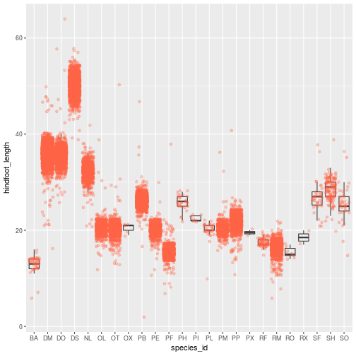

Notice how the boxplot layer is behind the jitter layer? What do you need to
change in the code to put the boxplot in front of the points such that it's not
hidden.

> ### Challenges
>
> Boxplots are useful summaries, but hide the *shape* of the distribution. For
> example, if there is a bimodal distribution, this would not be observed with a
> boxplot. An alternative to the boxplot is the violin plot (sometimes known as a
> beanplot), where the shape (of the density of points) is drawn.
>
> - Replace the box plot with a violin plot; see `geom_violin()`
>
> In many types of data, it is important to consider the *scale* of the
> observations.  For example, it may be worth changing the scale of the axis to
> better distribute the observations in the space of the plot.  Changing the scale
> of the axes is done similarly to adding/modifying other components (i.e., by
> incrementally adding commands).
>
> - Represent weight on the log10 scale; see `scale_y_log10()`
>
> - Create boxplot for `hindfoot_length`.
>
> - Add color to the datapoints on your boxplot according to the plot from which
>   the sample was taken (`plot_id`)

Hint: Check the class for `plot_id`. Consider changing the class of `plot_id`
from integer to factor. Why does this change how R makes the graph?


## Plotting time series data

Let's calculate number of counts per year for each species. To do that we need
to group data first and count records within each group.


```r
yearly_counts <- surveys_complete %>%
                 group_by(year, species_id) %>%
                 tally
```

Timelapse data can be visualised as a line plot with years on x axis and counts
on y axis.


```r
ggplot(data = yearly_counts, aes(x = year, y = n)) +
     geom_line()
```

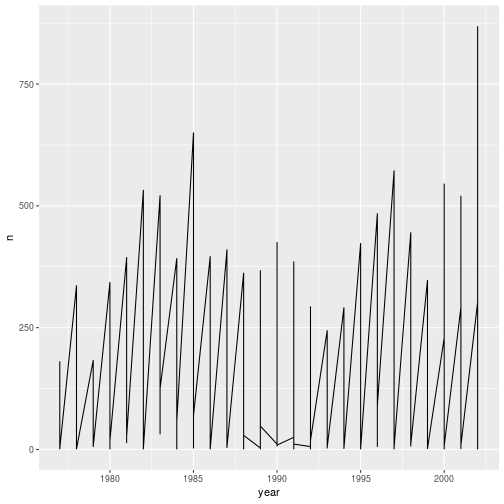

Unfortunately this does not work, because we plot data for all the species
together. We need to tell ggplot to draw a line for each species by modifying
the aesthetic function to include `group = species_id`.


```r
ggplot(data = yearly_counts, aes(x = year, y = n, group = species_id)) +
    geom_line()
```

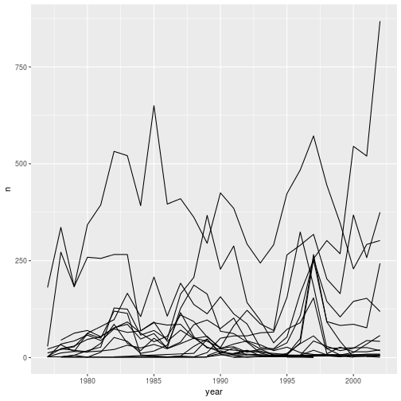

We will be able to distinguish species in the plot if we add colors.


```r
ggplot(data = yearly_counts, aes(x = year, y = n, group = species_id, colour = species_id)) +
    geom_line()
```


## Faceting

ggplot has a special technique called *faceting* that allows to split one plot
into multiple plots based on a factor included in the dataset. We will use it to
make one plot for a time series for each species.


```r
ggplot(data = yearly_counts, aes(x = year, y = n, group = species_id, colour = species_id)) +
    geom_line() +
    facet_wrap(~ species_id)
```

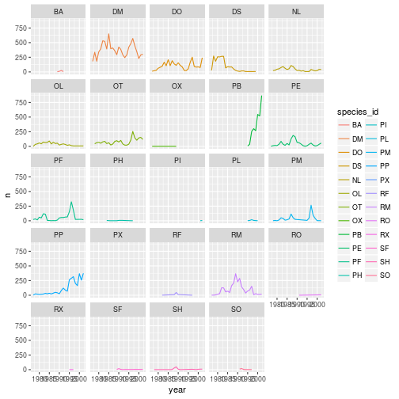

Now we would like to split line in each plot by sex of each individual
measured. To do that we need to make counts in data frame grouped by year,
species_id, and sex:


```r
 yearly_sex_counts <- surveys_complete %>%
                      group_by(year, species_id, sex) %>%
                      tally
```

We can now make the faceted plot splitting further by sex (within a single plot):


```r
 ggplot(data = yearly_sex_counts, aes(x = year, y = n, color = species_id, group = sex)) +
     geom_line() +
     facet_wrap(~ species_id)
```


Usually plots with white background look more readable when printed.  We can set
the background to white using the function `theme_bw()`. Additionally you can also remove
the grid.


```r
 ggplot(data = yearly_sex_counts, aes(x = year, y = n, color = species_id, group = sex)) +
     geom_line() +
     facet_wrap(~ species_id) +
     theme_bw() +
     theme(panel.grid.major.x = element_blank(),
	   panel.grid.minor.x = element_blank(),
	   panel.grid.major.y = element_blank(),
	   panel.grid.minor.y = element_blank())
```


To make the plot easier to read, we can color by sex instead of species (species
are already in separate plots, so we don't need to distinguish them further).


```r
ggplot(data = yearly_sex_counts, aes(x = year, y = n, color = sex, group = sex)) +
    geom_line() +
    facet_wrap(~ species_id) +
    theme_bw()
```

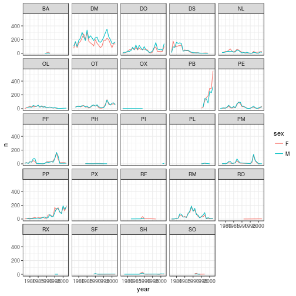


## Challenge

> Use what you just learned to create a plot that depicts how the average weight
> of each species changes through the years.

<details>

```r
yearly_weight <- surveys_complete %>%
                 group_by(year, species_id) %>%
                 summarise(avg_weight = mean(weight))
ggplot(data = yearly_weight, aes(x=year, y=avg_weight, color = species_id, group = species_id)) +
    geom_line() +
    facet_wrap(~ species_id) +
    theme_bw()
```


</details>

The `facet_wrap` geometry extracts plots into an arbitrary number of dimensions
to allow them to cleanly fit on one page. On the other hand, the `facet_grid`
geometry allows you to explicitly specify how you want your plots to be
arranged via formula notation (`rows ~ columns`; a `.` can be used as
a placeholder that indicates only one row or column).

Let's modify the previous plot to compare how the weights of male and females
has changed through time.


```r
## One column, facet by rows
yearly_sex_weight <- surveys_complete %>%
    group_by(year, sex, species_id) %>%
    summarize(avg_weight = mean(weight))
ggplot(data = yearly_sex_weight, aes(x=year, y=avg_weight, color = species_id, group = species_id)) +
    geom_line() +
    facet_grid(sex ~ .)
```

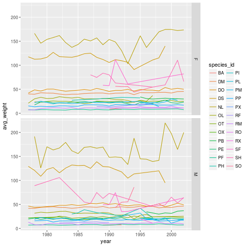


```r
# One row, facet by column
ggplot(data = yearly_sex_weight, aes(x=year, y=avg_weight, color = species_id, group = species_id)) +
    geom_line() +
    facet_grid(. ~ sex)
```

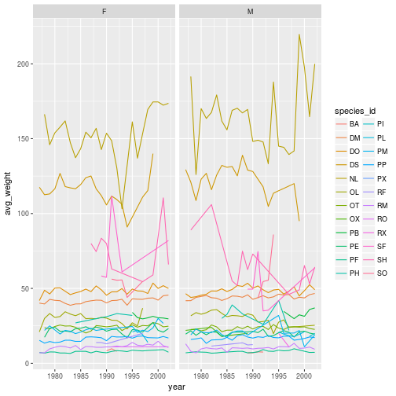

## Customization

Take a look at the ggplot2 cheat sheet
(https://www.rstudio.com/wp-content/uploads/2015/08/ggplot2-cheatsheet.pdf), and
think of ways to improve the plot. You can write down some of your ideas as
comments in the Etherpad.

Now, let's change names of axes to something more informative than 'year'
and 'n' and add a title to this figure:


```r
ggplot(data = yearly_sex_counts, aes(x = year, y = n, color = sex, group = sex)) +
    geom_line() +
    facet_wrap(~ species_id) +
    labs(title = 'Observed species in time',
         x = 'Year of observation',
         y = 'Number of species') +
    theme_bw()
```

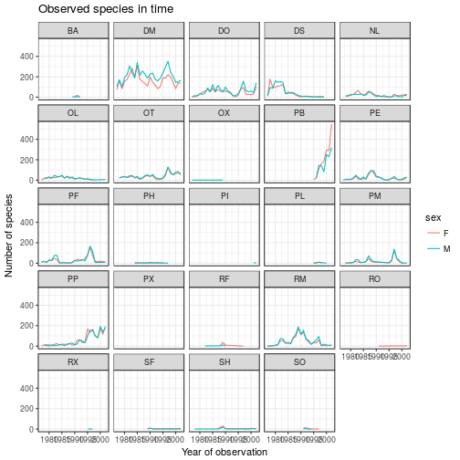

The axes have more informative names, but their readability can be improved by
increasing the font size. While we are at it, we'll also change the font family:


```r
ggplot(data = yearly_sex_counts, aes(x = year, y = n, color = sex, group = sex)) +
    geom_line() +
    facet_wrap(~ species_id) +
    labs(title = 'Observed species in time',
        x = 'Year of observation',
        y = 'Number of species') +
    theme_bw() +
    theme(text=element_text(size=16, family="Arial"))
```

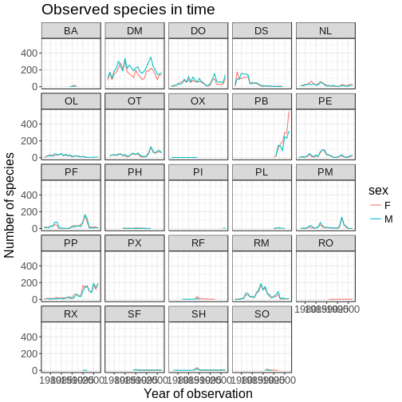

After our manipulations we notice that the values on the x-axis are still not
properly readable. Let's change the orientation of the labels and adjust them
vertically and horizontally so they don't overlap. You can use a 90 degree
angle, or experiment to find the appropriate angle for diagonally oriented
labels.


```r
ggplot(data = yearly_sex_counts, aes(x = year, y = n, color = sex, group = sex)) +
    geom_line() +
    facet_wrap(~ species_id) +
    labs(title = 'Observed species in time',
        x = 'Year of observation',
        y = 'Number of species') +
    theme_bw() +
    theme(axis.text.x = element_text(colour="grey20", size=12, angle=90, hjust=.5, vjust=.5),
                        axis.text.y = element_text(colour="grey20", size=12),
          text=element_text(size=16, family="Arial"))
```

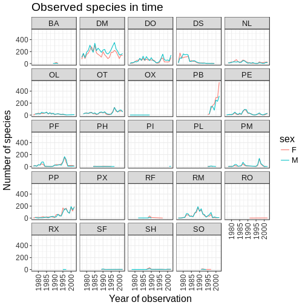

If you like the changes you created to the default theme, you can save them as
an object to easily apply them to other plots you may create:


```r
arial_grey_theme <- theme(axis.text.x = element_text(colour="grey20", size=12, angle=90, hjust=.5, vjust=.5),
                          axis.text.y = element_text(colour="grey20", size=12),
                          text=element_text(size=16, family="Arial"))
ggplot(surveys_complete, aes(x = species_id, y = hindfoot_length)) +
    geom_boxplot() +
    arial_grey_theme
```

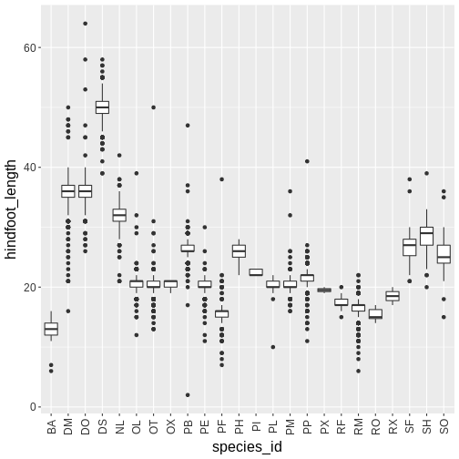

With all of this information in hand, please take another five minutes to either
improve one of the plots generated in this exercise or create a beautiful graph
of your own. Use the RStudio ggplot2 cheat sheet, which we linked earlier for
inspiration.

Here are some ideas:

* See if you can change thickness of the lines.
* Can you find a way to change the name of the legend? What about its labels?
* Use a different color palette (see http://www.cookbook-r.com/Graphs/Colors_(ggplot2)/)

After creating your plot, you can save it to a file in your favourite format.
You can easily change the dimension (and its resolution) of your plot by
adjusting the appropriate arguments (`width`, `height` and `dpi`):


```r
my_plot <- ggplot(data = yearly_sex_counts, aes(x = year, y = n, color = sex, group = sex)) +
    geom_line() +
    facet_wrap(~ species_id) +
    labs(title = 'Observed species in time',
        x = 'Year of observation',
        y = 'Number of species') +
    theme_bw() +
    theme(axis.text.x = element_text(colour="grey20", size=12, angle=90, hjust=.5, vjust=.5),
                        axis.text.y = element_text(colour="grey20", size=12),
          text=element_text(size=16, family="Arial"))
ggsave("name_of_file.png", my_plot, width=15, height=10)
```
