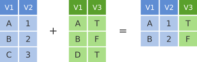
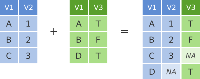

# Joining

In many real life situations, data are spread across multiple tables
or spreadsheets. Usually this occurs because different types of
information about a subject, e.g. a patient, are collected from
different sources. It may be desirable for some analyses to combine
data from two or more tables into a single data frame based on a
common column, for example, an attribute that uniquely identifies the
subject.

`dplyr` provides a set of join functions for combining two data frames
based on matches within specified columns. These operations are very
similar to carrying out join operations between tables in a relational
database using SQL.

```{r, message=FALSE}
library("dplyr")
```

### `left_join`

To illustrate join operations we'll first consider the most common
type, a "left join". In the schematic below the two data frames share
a common column, V1. We can combine the two data frames into a single
data frame by matching rows in the first data frame with those in the
second data frame that share the same value of V1.


`left_join` returns all rows from the first data frame regardless of
whether there is a match in the second data frame. Rows with no match
are included in the resulting data frame but have `NA` values in the
additional columns coming from the second data frame.

Here's an example in which details about members of the Beatles and
Rolling Stones are contained in two tables, using data frames
conveniently provided by `dplyr`. The name column identifies each of
the band members and is used for matching rows from the two tables.

```{r}
band_members
band_instruments
```

```{r}
left_join(band_members, band_instruments, by = "name")
```

`right_join` is similar but returns all rows from the second data frame that have a match with rows in the first data frame based on the specified column.

```{r}
right_join(band_members, band_instruments, by = "name")
```

### `inner_join`

It is also possible to return only those rows where matches could be made. The `inner_join` function accomplishes this.



```{r}
inner_join(band_members, band_instruments, by = "name")
```

### `full_join`

We've seen how missing rows from one table can be retained in the joined data frame using `left_join` or `right_join` but sometimes data for a given subject may be missing from either of the tables and we still want that subject to appear in the combined table. A `full_join` will return all rows and all columns from the two tables and where there are no matching values, `NA` values are used to fill in the missing values.



```{r}
full_join(band_members, band_instruments, by = "name")
```

### Joining on columns with different headers

The columns that are used for joining two tables do not have to have
the same name, e.g.

```{r}
band_instruments2
left_join(band_members, band_instruments2, by = c("name" = "artist"))
```

### Multiple matches in join operations

Where there are multiple rows in one or both of the two tables for the
thing that is being joined, these will be represented in the combined
table. All combinations of the matching rows will be included.

```{r}
df1 <- data_frame(
  name = c("Mick",   "John",    "Paul",    "Paul"),
  band = c("Stones", "Beatles", "Beatles", "Wings")
)
df2 <- data_frame(
  name =  c("John",   "Paul", "Paul",   "Keith"),
  plays = c("guitar", "bass", "guitar", "guitar")
)
left_join(df1, df2, by = "name")
```

### Joining by matching on multiple columns

We can specify multiple columns to use for matching rows. This is
useful where the uniquely-identifying information for a subject is
containing in more than one column. In the following we add another
band and musician to our two data frames such that we now can no
longer uniquely identify band members from the first name, so now we
use a combination of both first name and surname to join the two
tables.

```{r}
df1 <- data_frame(
  forename = c("Mick",   "John",    "Paul",      "John"),
  surname =  c("Jagger", "Lennon",  "McCartney", "Squire"),
  band =     c("Stones", "Beatles", "Beatles",   "Roses")
)
df2 <- data_frame(
  forename = c("John",   "Paul",      "Keith",    "John"),
  surname =  c("Lennon", "McCartney", "Richards", "Squire"),
  plays =    c("guitar", "bass",      "guitar",   "guitar")
)
left_join(df1, df2, by = c("forename", "surname"))
```

*Exercise: see what happens if you try just joining on first name.*

### Filtering joins

A variation on the join operations we've considered are `semi_join`
and `anti_join` that filter the rows in one table based on matches or
lack of matches to rows in another table.

```{r}
# semi_join returns all rows from the first table where there are
# matches in the other table
semi_join(band_members, band_instruments, by = "name")
```

```{r}
# anti_join returns all rows where there is no match in the other
# table
anti_join(band_members, band_instruments, by = "name")
```
